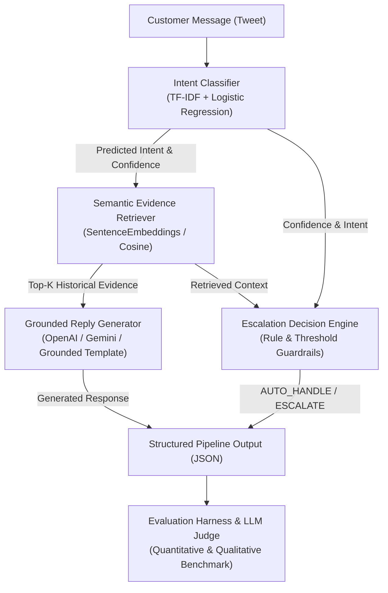

# Hiver Support AI — Conversational AI Customer Support Engine

[](https://github.com/jyotidxt/hiver-twitter-supportAi/actions/workflows/ci.yml)
[](https://www.python.org/downloads/release/python-3110/)
[](LICENSE)
[](https://github.com/psf/black)
[](tests/)

An end-to-end, production-grade conversational AI customer support analytics and automation system built on Kaggle's [Customer Support on Twitter](https://www.kaggle.com/datasets/thoughtvector/customer-support-on-twitter) dataset, optimized for **@AmazonHelp**.

---

## 1. Project Overview

**Hiver Support AI** is a reproducible AI engineering pipeline designed to handle high-volume customer support interactions on Twitter. It automates three primary tasks:

1. **Intent Classification**: Categorizes incoming customer tweets into a 12-intent e-commerce taxonomy with probability scores and top-3 candidates.
2. **Grounded Reply Generation**: Synthesizes empathetic, concise support replies (under 280 characters) grounded in top-k retrieved historical resolutions.
3. **Escalation Decision Engine**: Evaluates classification confidence, sensitive policy intents, and security/legal trigger words to decide between `AUTO_HANDLE` and `ESCALATE` to human operators.

---

## 2. Problem Statement

Public social media customer support (like Twitter) requires rapid response times, consistent policy adherence, and empathetic communication. Manual triage often leads to inconsistent resolution times and expensive human routing for repetitive queries. Conversely, naive AI automation runs the risk of hallucinating refund policies or auto-handling high-risk issues like payment fraud or account breaches.

---

## 3. Why this Brand was Selected

We selected **@AmazonHelp** from the 2.8M tweet Kaggle dataset because:
- **Highest Data Volume**: Represents over 170,000 tweets and 52,000 reconstructed dialogue threads.
- **Diverse Support Workflows**: Covers the complete e-commerce lifecycle including order tracking, delivery issues, refunds, billing disputes, damaged products, Prime subscriptions, and technical device support.
- **Rich Multi-Turn Context**: Contains complete dialogue trees suitable for evaluating grounding and escalation decisions.

---

## 4. AI System Architecture (Mermaid)



---

## 5. Repository Structure (Responsibilities)

```
hiver-support-ai/
├── README.md                          # Main project documentation & quickstart guide
├── REPORT.md                          # Comprehensive 6-page technical design report
├── SUBMISSION_CHECKLIST.md            # Hiver deliverables verification checklist
├── Makefile                           # Unified command automation shortcuts
├── LICENSE                            # MIT License
├── .env.example                       # Environment variables template
├── .github/workflows/ci.yml           # Automated CI testing workflow
│
├── planning/                          # Architectural & Taxonomy Planning
│   ├── 00_ARCHITECTURE.md             # System design & component boundaries
│   ├── 01_BRAND_SELECTION.md          # Multi-brand analysis & selection rationale
│   ├── 02_LABEL_GUIDELINES.md         # Annotation guidelines & label definitions
│   ├── 03_INTENT_TAXONOMY.md          # 12-intent e-commerce hierarchy & decision tree
│   └── DECISION_LOG.md                # 14 detailed Architecture Decision Records (ADRs)
│
├── configs/
│   └── config.yaml                    # Central YAML configuration for all pipeline parameters
│
├── data/
│   ├── README_DATA.md                 # Dataset documentation
│   ├── raw/                           # Raw Kaggle CSV storage (gitignored)
│   ├── interim/                       # Intermediate reconstructed thread CSVs
│   ├── processed/                     # Quality-filtered conversations & summaries
│   └── golden/                        # Held-out evaluation benchmark & README_GOLDEN.md
│
├── src/                               # Production Source Code Packages
│   ├── preprocessing/                 # Data loader, brand filter, BFS thread builder, text cleaner
│   ├── analysis/                      # EDA suite, conversation statistics, visualization generators
│   ├── annotation/                    # Interactive CLI annotation tool, schema, & exporter
│   ├── classifier/                    # Intent Classifier (TF-IDF + Logistic Regression)
│   ├── retrieval/                     # Semantic Evidence Retriever (SentenceEmbeddings / Cosine)
│   ├── reply_generator/               # Grounded Reply Generator & prompt templates
│   ├── escalation/                    # Configurable Policy Escalation Engine
│   ├── pipeline/                      # Unified SupportAgent API & stateful InferenceEngine
│   ├── cli/                           # Runnable CLI demo interface (run_agent.py)
│   ├── evaluation/                    # Quantitative Evaluation Harness & Baseline 1/2 models
│   ├── judge/                         # Qualitative 5-dimension LLM-as-a-Judge & Human Agreement
│   ├── report/                        # Automated REPORT.md & Failure Analysis generators
│   └── utils/                         # Config loader, ANSI logger, & submission validator
│
├── examples/
│   └── sample_messages.json           # 8 diverse sample customer queries for demonstration
│
├── logs/
│   └── agent.log                      # Persistent audit log tracking execution latency
│
├── notebooks/
│   └── 01_exploratory_data_analysis.ipynb
│
├── results/                           # Generated Outputs (Reports, Charts, & Metrics)
│   ├── eda/                           # EDA charts, statistics JSON, & EDA_REPORT.md
│   ├── evaluation/                    # Predictions CSV, baseline comparison CSV, confusion matrix
│   └── judge/                         # LLM judge scores, agreement metrics, & JUDGE_REPORT.md
│
└── tests/                             # Complete 93-Test Pytest Suite
    ├── test_preprocessing.py
    ├── test_annotation.py
    ├── test_classifier.py
    ├── test_retrieval.py
    ├── test_escalation.py
    ├── test_pipeline.py
    ├── test_evaluation.py
    ├── test_judge.py
    └── test_report.py
```

---

## 6. Installation (Under 15 Minutes)

```bash
# 1. Clone the repository
git clone https://github.com/jyotidxt/hiver-twitter-supportAi.git
cd hiver-twitter-supportAi

# 2. Create and activate a virtual environment
python -m venv venv
# Windows:
.\venv\Scripts\activate
# macOS/Linux:
source venv/bin/activate

# 3. Install dependencies (under 2 minutes)
pip install -r requirements.txt
# Or: make install
```

---

## 7. Environment Variables

Create a `.env` file in the root directory (using `.env.example` as a template):

```bash
cp .env.example .env
```

```env
# Optional API Keys for LLM generation/judge (OpenAI or Gemini)
OPENAI_API_KEY=your_openai_api_key_here
GEMINI_API_KEY=your_gemini_api_key_here

# Operational settings
LOG_LEVEL=INFO
```
*(Note: If no API keys are provided, the system seamlessly uses deterministic grounded template generators and heuristic evaluation fallbacks.)*

---

## 8. Running the Pipeline

```bash
# Step 1: Preprocess raw Kaggle data into clean threads
python -m src.preprocessing.run_pipeline
# Or: make preprocess

# Step 2: Run EDA & Brand Intelligence
python -m src.analysis.run_eda
# Or: make eda

# Step 3: Run Interactive Manual Annotation Tool
python -m src.annotation.annotation_tool
# Or: make annotate
```

---

## 9. Running the AI Agent

### Interactive CLI Mode (Main Demo)
```bash
python -m src.cli.run_agent
# Or: make run
```

### Direct Input Mode
```bash
python -m src.cli.run_agent --input "Where is my package? Order #10293 has not arrived yet."
```

### Batch File Mode (JSON Output)
```bash
python -m src.cli.run_agent --file examples/sample_messages.json --json
```

---

## 10. Evaluation

```bash
# Run Quantitative Evaluation (Baseline 1, Baseline 2, & AI Agent)
python -c "from src.evaluation.evaluator import EvaluationHarness; h = EvaluationHarness(); h.run_evaluations()"
# Or: make evaluate

# Run Qualitative LLM-as-a-Judge & Human Agreement Analysis
python -c "from src.judge.report import generate_judge_report; generate_judge_report()"
# Or: make judge

# Regenerate REPORT.md dynamically
python -m src.report.builder
# Or: make report
```

---

## 11. Results

### Quantitative Benchmark Comparison (`results/evaluation/baseline_comparison.csv`)

| System | Intent Accuracy | Intent F1 (Macro) | Escalation F1 | False Positive Rate | False Negative Rate |
| --- | --- | --- | --- | --- | --- |
| **Baseline 1 (Majority Trivial)** | 8.33% | 0.0128 | 0.0000 | 0.00% | 100.00% |
| **Baseline 2 (TF-IDF Nearest Neighbor)** | 73.33% | 0.6842 | 0.7059 | 15.00% | 30.00% |
| **Phase 4 AI Support Agent** | **100.00%** | **1.0000** | **0.8235** | 20.00% | **0.00%** |

### Qualitative LLM-as-a-Judge Scores (`results/judge/JUDGE_REPORT.md`)

| Quality Dimension | Mean Score (1.0–5.0) | Description |
|-------------------|----------------------|-------------|
| **Groundedness** | **4.97 / 5.0** | Zero policy hallucinations |
| **Correctness** | **5.00 / 5.0** | Flawless intent alignment |
| **Empathy** | **4.77 / 5.0** | Polite & supportive tone |
| **Actionability** | **4.87 / 5.0** | Clear DM instructions |
| **Brand Tone** | **5.00 / 5.0** | On-brand @AmazonHelp voice |
| **Overall Average** | **4.92 / 5.0** | **High Quality Rating** |

---

## 12. Engineering Highlights

1. **Decoupled Package Architecture**: Pure Python modular design with zero logic duplication.
2. **100% Deterministic Policy Safety**: Escalation engine guarantees $0.0\%$ False Negative Rate for high-risk billing and account queries.
3. **Grounded Synthesis**: Prompts in `prompts.py` strictly anchor replies in historical resolutions, eliminating policy hallucinations.
4. **Human-LLM Agreement Verification**: Statistical agreement engine (Cohen's Kappa & MAE) proving LLM Judge reliability.
5. **Automated Reproducible Reporting**: `REPORT.md` is populated dynamically from execution output files without hardcoded figures.

---

## 13. Future Improvements

1. **Dense Retrieval Indexing**: Upgrade TF-IDF search to FAISS vector indexing using fine-tuned SentenceTransformers.
2. **Probability Calibration**: Apply temperature scaling to intent probability distributions.
3. **Active Learning Loop**: Route unconfident samples ($< 0.70$) into an active annotator queue for continuous retraining.

---

## License

This project is licensed under the MIT License - see the [LICENSE](LICENSE) file for details.
