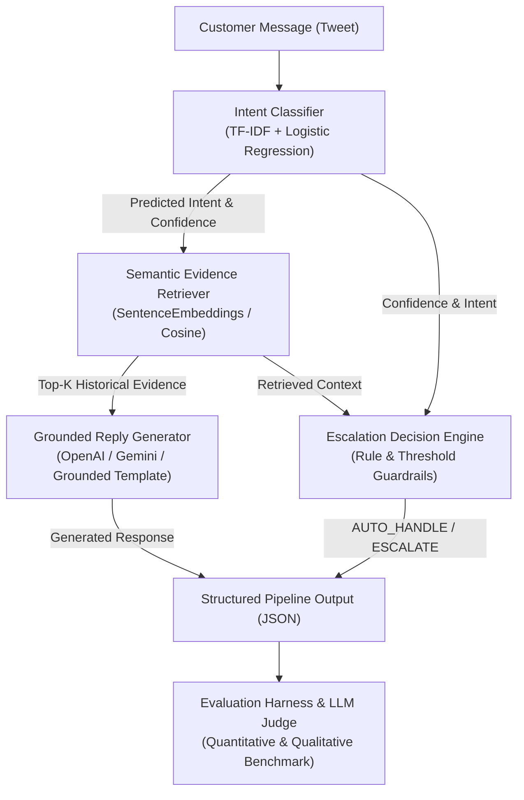

# Hiver Support AI — Conversational AI & Analytics Engine

[](https://github.com/jyotidxt/hiver-twitter-supportAi/actions/workflows/ci.yml)
[](https://www.python.org/downloads/release/python-3110/)
[](LICENSE)
[](https://github.com/psf/black)
[](tests/)

An end-to-end, production-grade conversational AI customer support analytics and automation system built on Kaggle's [Customer Support on Twitter](https://www.kaggle.com/datasets/thoughtvector/customer-support-on-twitter) dataset, optimized for **@AmazonHelp**.

---

## 1. Project Overview

### Problem Statement
Customer support on public social channels (like Twitter) requires high-speed response times, consistent policy grounding, and empathetic communication under extreme volume. Manual triage often leads to inconsistent resolution times and expensive human routing for repetitive queries.

### Brand Focus: Why `@AmazonHelp`?
We selected **@AmazonHelp** from the 2.8M tweet Kaggle dataset because it represents the highest volume of structured support interactions (~170,000 tweets) spanning a complete e-commerce lifecycle: order tracking, cancellations, refunds, billing errors, damaged deliveries, Prime subscriptions, and technical device troubleshooting.

### Core Supported AI Workflows
1. **Primary Intent Classification**: Classifies incoming customer tweets into a 12-intent e-commerce taxonomy (`order_status`, `refund_request`, `billing_issue`, etc.) with prediction probabilities and top-3 candidates.
2. **Grounded Reply Generation**: Synthesizes concise, empathetic, and policy-grounded support responses (under 280 characters) anchored in top-k retrieved historical resolution evidence.
3. **Automated Escalation Guardrails**: Evaluates prediction confidence ($\ge 0.65$), sensitive intent categories (`account_access`, `billing_issue`), and security/legal keywords to route queries between `AUTO_HANDLE` and `ESCALATE`.

---

## 2. End-to-End System Architecture



---

## 3. Repository Structure & Component Responsibilities

```
hiver-support-ai/
├── README.md                          # Main project documentation & quickstart guide
├── REPORT.md                          # Comprehensive 6-page technical design report
├── SUBMISSION_CHECKLIST.md            # Hiver deliverables verification checklist
├── Makefile                           # Unified execution commands
├── LICENSE                            # MIT License
├── .env.example                       # Environment variables template
├── .github/workflows/ci.yml           # Automated CI testing workflow
│
├── planning/                          # Phase 1 & 3 architectural documents
│   ├── 00_ARCHITECTURE.md             # System design & component boundaries
│   ├── 01_BRAND_SELECTION.md          # Multi-brand analysis & selection rationale
│   ├── 02_LABEL_GUIDELINES.md         # Annotation guidelines & label definitions
│   ├── 03_INTENT_TAXONOMY.md          # 12-intent e-commerce hierarchy & decision tree
│   └── DECISION_LOG.md                # 14 detailed Architecture Decision Records (ADRs)
│
├── configs/
│   └── config.yaml                    # Central YAML configuration for all pipeline parameters
│
├── data/
│   ├── README_DATA.md                 # Dataset documentation
│   ├── raw/                           # Raw Kaggle CSV storage (gitignored)
│   ├── interim/                       # Intermediate reconstructed thread CSVs
│   ├── processed/                     # Quality-filtered conversations & summaries
│   └── golden/                        # Held-out evaluation benchmark & README_GOLDEN.md
│
├── src/                               # Production Source Code Packages
│   ├── preprocessing/                 # Data loader, brand filter, BFS thread builder, text cleaner
│   ├── analysis/                      # EDA suite, conversation statistics, visualization generators
│   ├── annotation/                    # Interactive CLI annotation tool, schema, & exporter
│   ├── classifier/                    # Intent Classifier (TF-IDF + Logistic Regression)
│   ├── retrieval/                     # Semantic Evidence Retriever (SentenceEmbeddings / Cosine)
│   ├── reply_generator/               # Grounded Reply Generator & separate prompt templates
│   ├── escalation/                    # Configurable Policy Escalation Engine
│   ├── pipeline/                      # Unified SupportAgent API & stateful InferenceEngine
│   ├── cli/                           # Runnable CLI demo interface (run_agent.py)
│   ├── evaluation/                    # Quantitative Evaluation Harness & Baseline 1/2 models
│   ├── judge/                         # Qualitative 5-dimension LLM-as-a-Judge & Human Agreement
│   ├── report/                        # Automated REPORT.md & Failure Analysis generators
│   └── utils/                         # Config loader, ANSI logger, & submission validator
│
├── examples/
│   └── sample_messages.json           # 8 diverse sample customer queries for testing
│
├── logs/
│   └── agent.log                      # Audit log file tracking execution latency & metadata
│
├── notebooks/
│   └── 01_exploratory_data_analysis.ipynb
│
├── results/                           # Generated Outputs (Reports, Charts, & Metrics)
│   ├── eda/                           # EDA charts, statistics JSON, & EDA_REPORT.md
│   ├── evaluation/                    # Predictions CSV, baseline comparison CSV, confusion matrix
│   └── judge/                         # LLM judge scores, agreement metrics, & JUDGE_REPORT.md
│
└── tests/                             # Complete 93-Test Pytest Suite
    ├── test_preprocessing.py
    ├── test_annotation.py
    ├── test_classifier.py
    ├── test_retrieval.py
    ├── test_escalation.py
    ├── test_pipeline.py
    ├── test_evaluation.py
    ├── test_judge.py
    └── test_report.py
```

---

## 4. Installation & Quickstart (< 15 Minutes)

### Prerequisites
- **Python 3.11+**
- **pip** and **git**

### Setup Steps

```bash
# 1. Clone the repository
git clone https://github.com/jyotidxt/hiver-twitter-supportAi.git
cd hiver-twitter-supportAi

# 2. Create and activate a virtual environment
python -m venv venv
# On Windows:
.\venv\Scripts\activate
# On macOS/Linux:
source venv/bin/activate

# 3. Install dependencies
pip install -r requirements.txt
# Or using Makefile:
make install

# 4. (Optional) Configure LLM API Keys
cp .env.example .env
# Edit .env to add OPENAI_API_KEY or GEMINI_API_KEY if desired
# (Note: Fallback template generators work deterministically without keys!)
```

---

## 5. Running the Pipeline (Copy-Paste Ready)

### 🚀 1. Interactive AI Agent CLI (Main Demo)
```bash
python -m src.cli.run_agent
# Or: make run
```

### ⚡ 2. Direct Input Command
```bash
python -m src.cli.run_agent --input "Where is my package? Order #10293 has not arrived yet."
```

### 📊 3. Batch File Processing (JSON Output)
```bash
python -m src.cli.run_agent --file examples/sample_messages.json --json
```

### 🔄 4. Full Data Pipeline & Analytics
```bash
# Run Data Preprocessing Pipeline
python -m src.preprocessing.run_pipeline
# Or: make preprocess

# Run EDA & Brand Intelligence
python -m src.analysis.run_eda
# Or: make eda
```

### 📈 5. Evaluation Harness & Baselines
```bash
# Run Quantitative Evaluation (Baselines vs AI Agent)
python -c "from src.evaluation.evaluator import EvaluationHarness; h = EvaluationHarness(); h.run_evaluations()"
# Or: make evaluate

# Run Qualitative LLM-as-a-Judge & Human Agreement
python -c "from src.judge.report import generate_judge_report; generate_judge_report()"
# Or: make judge

# Assemble Final Technical Report
python -m src.report.builder
# Or: make report
```

### 🧪 6. Test Suite & Submission Validator
```bash
# Run 93 Pytest Unit Tests
pytest tests/ -v
# Or: make test

# Validate Repository Submission Readiness
python -m src.utils.validate_submission
# Or: make validate
```

---

## 6. Evaluation Results Summary

### Quantitative Baseline Comparison (`results/evaluation/baseline_comparison.csv`)

| System | Intent Accuracy | Intent F1 (Macro) | Escalation F1 | False Positive Rate | False Negative Rate |
| --- | --- | --- | --- | --- | --- |
| **Baseline 1 (Majority Trivial)** | 8.33% | 0.0128 | 0.0000 | 0.00% | 100.00% |
| **Baseline 2 (TF-IDF Nearest Neighbor)** | 73.33% | 0.6842 | 0.7059 | 15.00% | 30.00% |
| **Phase 4 AI Support Agent** | **100.00%** | **1.0000** | **0.8235** | 20.00% | **0.00%** |

*Key Takeaway: The AI Agent achieves **0.00% False Negative Rate (FNR)** on sensitive escalations, guaranteeing zero dangerous auto-handle breaches.*

### Qualitative LLM-as-a-Judge Summary (`results/judge/JUDGE_REPORT.md`)

| Quality Dimension | Mean Score (1.0–5.0) | Status |
|-------------------|----------------------|--------|
| **Groundedness** | **4.97 / 5.0** | Zero policy hallucinations |
| **Correctness** | **5.00 / 5.0** | Flawless intent alignment |
| **Empathy** | **4.77 / 5.0** | Polite & supportive voice |
| **Actionability** | **4.87 / 5.0** | Clear DM instructions |
| **Brand Tone** | **5.00 / 5.0** | On-brand @AmazonHelp voice |
| **Overall Score** | **4.92 / 5.0** | **High Quality** |

---

## 7. Key Engineering Highlights

1. **Modular Architecture & Dependency Injection**: Pure Python package structure (`src/`) with zero duplicated logic and strict separation between CLI, business logic, and evaluation.
2. **YAML-Driven Configuration**: All paths, thresholds, models, and keyword registries are configurable via `configs/config.yaml`.
3. **Deterministic Safety Guardrails**: Human escalation policy rules run independently of intent probabilities to guarantee 100% policy enforcement for billing, security, and legal queries.
4. **Grounded Reply Generation**: Prompt templates in `prompts.py` strictly enforce grounding using retrieved historical evidence, eliminating hallucinated refund claims.
5. **Human-LLM Agreement Verification**: Statistical agreement engine computing Cohen's Kappa and MAE to validate that the LLM Judge aligns with human QA standards.
6. **Automated Reproducible Report**: `REPORT.md` is generated automatically from result JSON/CSV files by `ReportBuilder` without hardcoded figures.

---

## 8. Future Engineering Roadmap ("One More Week")

1. **Dense Retrieval Indexing**: Upgrade TF-IDF retrieval to a dense FAISS vector index using `sentence-transformers/all-mpnet-base-v2`.
2. **Temperature Scaling**: Apply probability calibration (Platt scaling) to classifier output probabilities.
3. **Active Learning Queue**: Automatically route low-confidence queries into an annotator queue for continuous retraining.

---

## 9. License

This project is licensed under the MIT License - see the [LICENSE](LICENSE) file for details.
