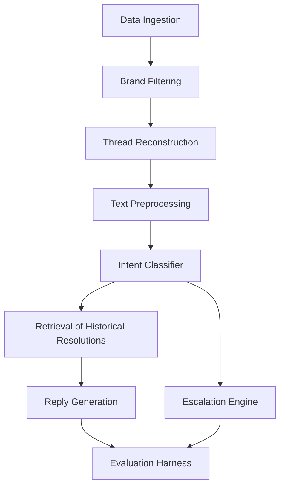

# planning/00_ARCHITECTURE.md

## 1. Project Vision

- **Problem statement**: Build an AI‑powered customer‑support agent that can automatically understand, respond to, and triage Twitter conversations for a single brand. The goal is to reduce manual support workload while preserving brand voice and ensuring timely escalation of complex issues.
- **Why a single brand?**: Focusing on one brand simplifies data collection, brand‑specific language modelling, and evaluation. It also demonstrates a repeatable pipeline that can later be generalized to multiple brands.
- **Definition of success**:  
  - The system reliably classifies intents, generates coherent replies, and flags escalations with a measurable improvement over baseline pipelines.  
  - Operational metrics (latency, error‑rate) meet production‑grade thresholds.  
  - The end‑to‑end workflow can be reproduced from raw tweet data to final response in a deterministic, documented manner.

## 2. Scope

**In Scope**
- Collection of public Twitter data for the selected brand.
- End‑to‑end pipeline covering ingestion → preprocessing → intent classification → reply generation → escalation decision.
- Evaluation harness for offline benchmark of each component.
- Documentation and reproducibility scripts.

**Out of Scope**
- Real‑time streaming deployment (batch processing only).
- Multi‑brand handling or cross‑brand knowledge transfer.
- Direct integration with Twitter API for posting replies (offline generation only).
- GUI or web UI for agents (focus is on backend architecture).
- Handling of non‑English tweets (English‑only pipeline).

## 3. System Architecture



**Modules**
- **Data Ingestion**: Scripts that pull raw tweet JSON from the Twitter archive or a supplied dump.
- **Brand Filtering**: Filter tweets containing the target brand’s handle/keywords.
- **Thread Reconstruction**: Group tweets into conversation threads using `in_reply_to_status_id` relationships.
- **Text Preprocessing**: Normalisation, URL removal, emoji handling, tokenisation, and optional entity masking.
- **Intent Classifier**: Fine‑tuned transformer (e.g., `roberta‑base`) that maps a tweet to a predefined intent taxonomy.
- **Retrieval of Historical Resolutions**: Vector‑store (FAISS) lookup of past resolved tickets to provide context to the generator.
- **Reply Generation**: Conditional language model (e.g., `flan‑t5‑xxl`) that takes the tweet, intent, and retrieved context to produce a brand‑consistent reply.
- **Escalation Engine**: Rule‑based + classifier that decides whether a reply should be auto‑sent or routed to a human operator.
- **Evaluation Harness**: Offline test harness that computes metrics for each stage, runs baselines, and generates reproducible reports.

## 4. Data Flow

1. **Raw tweet** arrives in the ingestion bucket.
2. **Brand filter** discards non‑brand tweets.
3. **Thread reconstruction** stitches the tweet with its conversation context.
4. **Preprocessing** cleans the text, expands contractions, and tokenises.
5. The cleaned tweet is fed to the **Intent Classifier** → produces an intent label.
6. The tweet (and intent) query the **Historical Retrieval** store → returns top‑k resolved examples.
7. **Reply Generation** consumes the original tweet, intent, and retrieved examples → produces a draft reply.
8. **Escalation Engine** evaluates the draft (confidence thresholds, sentiment, policy rules) → either marks as *auto‑reply* or *escalate*.
9. The final decision and reply (or escalation flag) are logged and passed to the **Evaluation Harness** for metric computation.

## 5. Repository Structure

```
planning/                      # Planning documents
│   00_ARCHITECTURE.md         # This architecture specification
│   01_DATA.md                # Data source & licensing notes
│   02_EVALUATION.md          # Metric definitions & benchmark scripts

src/                           # Source code (future implementation)
│   ingestion/                 # Data ingestion utilities
│   preprocessing/             # Text cleaning & tokenisation
│   modeling/                  # Classifier & generator wrappers
│   retrieval/                 # Vector‑store indexing & lookup
│   escalation/                # Escalation decision logic
│   evaluation/                # Offline evaluation harness
│   cli/                       # Command‑line entry points

configs/                       # YAML/JSON config files
│   intents.yaml               # Intent taxonomy
│   model_params.yaml          # Hyper‑parameters for training
│   evaluation.yaml            # Metric thresholds

tests/                         # Unit & integration tests
    data/                      # Sample tweet JSONs for testing
    fixtures/                  # Expected outputs for regression testing

scripts/                       # Helper scripts (e.g., data download, env setup)
    setup_env.sh               # Create conda/venv and install deps
    run_all.sh                 # End‑to‑end pipeline driver

docs/                          # Additional documentation
    design_decisions.md        # Rationale for model choices
    reproducibility.md         # Step‑by‑step reproducibility guide

requirements.txt               # Python package requirements
README.md                      # Project overview and quick‑start
```

## 6. Success Metrics

| Component               | Metric | Description |
|-------------------------|--------|-------------|
| Intent Classification   | Accuracy / F1 | Agreement with human‑annotated intents on held‑out set. |
| Reply Quality           | BLEU / ROUGE‑L / Human Rating | Compare generated replies to approved human responses. |
| Escalation Quality      | Precision / Recall of escalation flag | Ability to correctly flag tweets that require human attention. |
| Overall Trustworthiness | End‑to‑end Latency, Error Rate, Compliance Checks | System meets SLA (e.g., <2 s per tweet) and adheres to brand policy. |

*No absolute numbers are prescribed; targets will be defined after baseline results.*

## 7. Baselines

1. **Trivial Baseline**
   - **Intent**: Always predict the most frequent intent.
   - **Reply**: Echo the original tweet prefixed with a generic apology.
   - **Escalation**: Never escalates.
   - *Purpose*: Establish a lower bound and verify that evaluation pipeline works.

2. **Simple Baseline**
   - **Intent**: Logistic regression on TF‑IDF features.
   - **Reply**: Retrieval‑only – select the most similar past resolved reply using cosine similarity on TF‑IDF vectors.
   - **Escalation**: Rule‑based – escalate if confidence < 0.5 or if sentiment < –0.3.
   - *Purpose*: Provide a modest, reproducible reference that leverages classic NLP techniques.

## 8. Risks

| Risk | Impact | Mitigation |
|------|--------|------------|
| Data sparsity for rare intents | Poor classifier performance | Augment with synthetic tweets; use few‑shot prompting. |
| Brand‑specific language drift | Generated replies deviate from brand voice | Incorporate style‑transfer fine‑tuning; maintain a curated style guide. |
| Retrieval latency | End‑to‑end latency exceeds SLA | Pre‑compute embeddings, use efficient ANN index (FAISS) with GPU support. |
| Ethical / policy violations | Harmful or non‑compliant replies | Implement post‑generation safety filters; human‑in‑the‑loop for edge cases. |
| Reproducibility of randomness | Results vary across runs | Seed all random number generators; lock model versions via `requirements.txt`. |

## 9. Reproducibility Plan

1. Clone the repository.
2. Run `scripts/setup_env.sh` – creates a virtual environment and installs exact dependencies.
3. Execute `scripts/run_all.sh --sample-data` – uses a small packaged tweet sample (≈2k tweets).
4. The script downloads pre‑trained model checkpoints (cached) and runs the full pipeline, producing `artifacts/report.md`.
5. The entire process completes in <15 minutes on a modern laptop (8‑core CPU, 16 GB RAM, optional GPU). All random seeds are fixed, ensuring identical outputs.

## 10. Milestones

| Phase | Duration | Deliverables |
|-------|----------|--------------|
| **Phase 0 – Foundations** | 1 week | Repository skeleton, data ingestion script, sample tweet dump. |
| **Phase 1 – Baselines** | 2 weeks | Trivial & simple baselines, baseline evaluation report. |
| **Phase 2 – Intent Classifier** | 3 weeks | Fine‑tuned transformer, training script, intent evaluation metrics. |
| **Phase 3 – Retrieval Engine** | 2 weeks | FAISS index pipeline, latency benchmark. |
| **Phase 4 – Reply Generator** | 4 weeks | Conditional language model, style‑guide integration, generation metrics. |
| **Phase 5 – Escalation Logic** | 2 weeks | Rule‑based + classifier, escalation evaluation. |
| **Phase 6 – End‑to‑End Evaluation** | 2 weeks | Integrated test harness, reproducibility guide, final performance report. |
| **Phase 7 – Documentation & Handoff** | 1 week | Complete planning docs, README, hand‑over checklist. |

---
*Prepared by the senior staff ML engineer (architect) for the take‑home assignment.*
