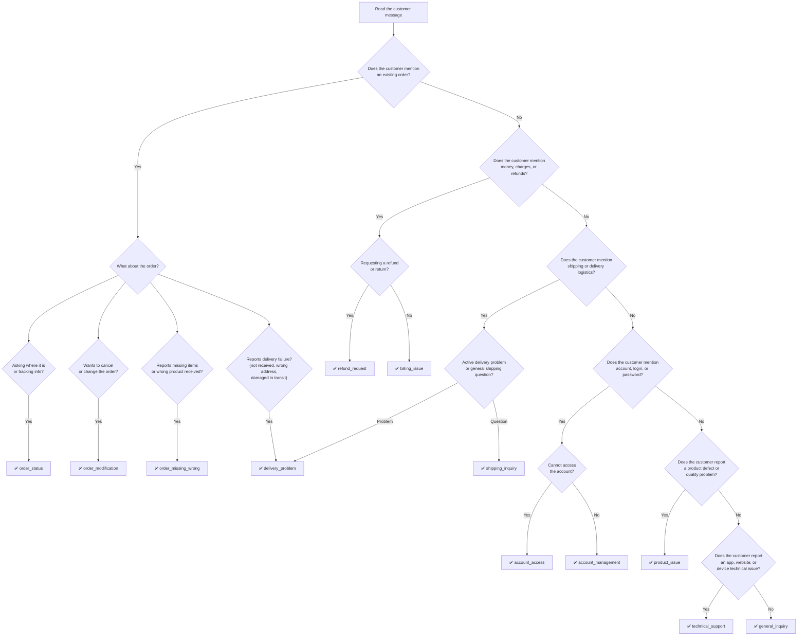

# Intent Taxonomy — AmazonHelp

**Phase 3 · Prompt 1 — Intent Taxonomy & Golden Dataset Design**
**Version**: 1.0
**Brand**: AmazonHelp
**Status**: Approved for annotation

---

## 1. Design Philosophy

### 1.1 Why Brand-Derived Intents

Generic intent taxonomies (Banking77, CLINC150, ATIS) fail in production customer support systems because they assume a universal distribution of customer needs. Amazon's e-commerce domain produces a fundamentally different intent distribution than a bank or airline.

This taxonomy is derived from three sources internal to this project:

1. **Phase 2 EDA cluster analysis** — TF-IDF + K-Means clustering of AmazonHelp opening messages identified recurring themes around orders, delivery, refunds, account access, and product issues.
2. **Escalation keyword analysis** — Payment, account, damage, and urgency keyword frequencies from the processed conversation dataset.
3. **Conversation structure patterns** — Multi-turn thread analysis revealed that complex resolution paths cluster around specific issue types.

Every intent in this document maps to observed customer language — not hypothetical scenarios.

### 1.2 Why Fewer, Well-Defined Intents Outperform Many Overlapping Labels

| Approach | Intents | Tradeoff |
|----------|---------|----------|
| Fine-grained (50+) | High precision per class | Low inter-annotator agreement, data starvation per class, high confusion rate |
| Coarse (3–5) | Easy to annotate | Low business value — cannot route or prioritize |
| **Balanced (10–15)** | **Actionable + annotatable** | **Best ratio of coverage to consistency** |

This taxonomy uses **12 intents** organized into **6 categories**. Each intent maps to a distinct customer support action, reducing ambiguity to a level where annotators can achieve ≥85% agreement without extensive training.

### 1.3 Primary Intent vs Secondary Context

Every conversation receives exactly **one primary intent** — the customer need that should drive the next support action.

Secondary signals (frustration, urgency, sentiment) are captured separately through escalation labels, **not** through intent duplication. This separation ensures:

- Intent classifiers learn **what** the customer needs
- Escalation classifiers learn **how urgently** they need it
- Reply generators can combine both signals independently

### 1.4 Consistency Drives ML Performance

A taxonomy is only as good as the agreement it produces among human annotators. Every design decision below prioritizes:

- **Mutual exclusivity** — no two intents should apply equally to the same message
- **Collective exhaustiveness** — every customer message maps to exactly one intent
- **Observable criteria** — intent is determined by what the customer **says**, not what we guess they feel

---

## 2. Intent Hierarchy

### 2.1 Category Overview

```
AmazonHelp Intent Taxonomy
│
├── 📦 ORDERS
│   ├── order_status          — Where is my order?
│   ├── order_modification    — Change, cancel, or update an order
│   └── order_missing_wrong   — Missing items, wrong items received
│
├── 💳 PAYMENTS & REFUNDS
│   ├── refund_request        — Requesting a refund or return
│   └── billing_issue         — Charges, pricing, payment method problems
│
├── 🚚 SHIPPING & DELIVERY
│   ├── delivery_problem      — Late, lost, damaged in transit, address issues
│   └── shipping_inquiry      — Shipping methods, costs, delivery windows
│
├── 👤 ACCOUNT & ACCESS
│   ├── account_access        — Login, password, locked account, verification
│   └── account_management    — Profile updates, subscriptions, Prime, settings
│
├── 🛠️ PRODUCT & TECHNICAL
│   ├── product_issue         — Defective, damaged, quality complaints
│   └── technical_support     — App, website, device, Alexa, Kindle issues
│
└── 💬 GENERAL
    └── general_inquiry       — Policy questions, praise, feedback, unclear
```

### 2.2 Full Hierarchy Table

| Category | Intent ID | Intent Name | Description | Expected Frequency |
|----------|-----------|-------------|-------------|-------------------|
| **Orders** | `order_status` | Order Status Inquiry | Customer asks about the current state, location, or ETA of a placed order | High |
| **Orders** | `order_modification` | Order Modification | Customer wants to cancel, change quantity, update shipping address, or modify an existing order | Medium |
| **Orders** | `order_missing_wrong` | Missing or Wrong Item | Customer reports items missing from delivery, wrong product received, or incomplete shipment | Medium |
| **Payments & Refunds** | `refund_request` | Refund or Return Request | Customer requests a refund, return label, or compensation for a purchase | High |
| **Payments & Refunds** | `billing_issue` | Billing or Charge Issue | Customer reports unexpected charges, double billing, price discrepancies, or payment method failures | Medium |
| **Shipping & Delivery** | `delivery_problem` | Delivery Problem | Package not delivered, marked delivered but not received, delivered to wrong address, or damaged in transit | High |
| **Shipping & Delivery** | `shipping_inquiry` | Shipping Inquiry | Questions about shipping options, costs, delivery timeframes, or carrier selection | Low |
| **Account & Access** | `account_access` | Account Access Issue | Cannot log in, forgot password, account locked, hacked, or two-factor authentication problems | Medium |
| **Account & Access** | `account_management` | Account Management | Profile updates, Prime membership questions, subscription changes, notification settings, wishlist issues | Low |
| **Product & Technical** | `product_issue` | Product Issue | Product arrived defective, broken, not as described, or quality does not meet expectations | Medium |
| **Product & Technical** | `technical_support` | Technical Support | App crashes, website errors, Kindle/Alexa/Echo device issues, streaming problems, download failures | Low |
| **General** | `general_inquiry` | General Inquiry | Policy clarification, positive feedback, general questions, or messages that do not fit other categories | Low |

---

## 3. Intent Definitions

### 3.1 `order_status` — Order Status Inquiry

| Field | Detail |
|-------|--------|
| **Purpose** | Classify messages where the customer's primary need is to learn the current state of an existing order |
| **Included Situations** | Asking where an order is; requesting tracking information; asking for estimated delivery date; following up on a delayed order; asking why an order shows a specific status |
| **Excluded Situations** | Wanting to cancel or change the order (`order_modification`); reporting that the order arrived wrong (`order_missing_wrong`); asking about a refund for the order (`refund_request`) |
| **Common Customer Language** | "where is my order", "tracking number", "when will it arrive", "order status", "still waiting", "hasn't shipped yet", "expected delivery", "order #" |
| **Borderline Cases** | "My order is late" → Use `order_status` if the customer is asking for information. Use `delivery_problem` if the customer is reporting a failure (e.g., "it was supposed to arrive yesterday and didn't"). If ambiguous, prefer `order_status`. |

### 3.2 `order_modification` — Order Modification

| Field | Detail |
|-------|--------|
| **Purpose** | Classify messages where the customer wants to change or cancel an existing order before or during fulfillment |
| **Included Situations** | Cancel order request; change delivery address; change quantity; add items to an existing order; change payment method on an order; request expedited shipping on an existing order |
| **Excluded Situations** | Asking about the order's current status without wanting changes (`order_status`); returning an order after receipt (`refund_request`) |
| **Common Customer Language** | "cancel my order", "change the address", "can I modify", "switch to faster shipping", "don't want this anymore", "update my order" |
| **Borderline Cases** | "I want to cancel and get a refund" → Primary intent is `order_modification` (cancel). The refund is a consequence, not the driver. If the order has already been delivered and the customer wants to return it, use `refund_request` instead. |

### 3.3 `order_missing_wrong` — Missing or Wrong Item

| Field | Detail |
|-------|--------|
| **Purpose** | Classify messages where the customer received a shipment but items are missing, wrong, or incomplete |
| **Included Situations** | Missing item from a multi-item order; wrong product sent; wrong color/size/variant; package empty or contents don't match packing slip; partial delivery with no explanation |
| **Excluded Situations** | Package not delivered at all (`delivery_problem`); product is defective but correct (`product_issue`); customer wants a refund for the wrong item (`refund_request` only if refund is the explicit ask, otherwise this intent) |
| **Common Customer Language** | "wrong item", "missing from my order", "this isn't what I ordered", "only received 2 of 3", "sent me the wrong size", "not what I expected" |
| **Borderline Cases** | "I got the wrong item and want a refund" → Primary is `order_missing_wrong` because the wrong item is the root cause. Refund is the desired resolution, captured as secondary context. |

### 3.4 `refund_request` — Refund or Return Request

| Field | Detail |
|-------|--------|
| **Purpose** | Classify messages where the customer's primary need is getting money back or returning a product |
| **Included Situations** | Requesting a refund; asking about return process; asking for a return label; inquiring about refund timeline; asking why a refund hasn't appeared; requesting compensation or credit |
| **Excluded Situations** | Reporting a billing error without requesting a refund (`billing_issue`); wanting to cancel an unshipped order (`order_modification`); complaining about product quality without asking for money back (`product_issue`) |
| **Common Customer Language** | "refund", "return", "money back", "when will I get my refund", "how do I return", "return label", "refund hasn't processed", "credit back", "reimburse" |
| **Borderline Cases** | "This product is broken, I want my money back" → Primary is `refund_request` because the explicit ask is financial. "This product is broken" without asking for money → `product_issue`. |

### 3.5 `billing_issue` — Billing or Charge Issue

| Field | Detail |
|-------|--------|
| **Purpose** | Classify messages about unexpected charges, payment failures, or pricing disputes |
| **Included Situations** | Charged twice; unauthorized charge; price higher than listed; payment method declined; gift card balance issues; Prime membership charge disputes; subscription billing problems |
| **Excluded Situations** | Requesting a refund for a purchase (`refund_request`); asking about order status after payment (`order_status`) |
| **Common Customer Language** | "charged twice", "unauthorized charge", "wrong amount", "payment declined", "overcharged", "billing error", "didn't authorize", "credit card", "gift card balance" |
| **Borderline Cases** | "I was charged but never received the item" → Primary is `billing_issue` if the customer focuses on the charge. Use `delivery_problem` if they focus on the missing package. Look for the **first explicit concern** in the message. |

### 3.6 `delivery_problem` — Delivery Problem

| Field | Detail |
|-------|--------|
| **Purpose** | Classify messages about packages that failed to deliver correctly |
| **Included Situations** | Package marked delivered but not received; delivered to wrong address; package stolen from porch; package damaged during transit; carrier left package in unsafe location; delivery significantly late beyond estimated window |
| **Excluded Situations** | Package delivered but wrong item inside (`order_missing_wrong`); asking about shipping options before placing an order (`shipping_inquiry`); general tracking questions (`order_status`) |
| **Common Customer Language** | "never received", "marked delivered but I don't have it", "wrong address", "package stolen", "damaged package", "driver left it in the rain", "delivery failed" |
| **Borderline Cases** | "My package is 3 days late" → If the customer is asking for information, use `order_status`. If reporting a problem and expecting resolution, use `delivery_problem`. The word "late" plus a problem framing signals `delivery_problem`. |

### 3.7 `shipping_inquiry` — Shipping Inquiry

| Field | Detail |
|-------|--------|
| **Purpose** | Classify pre-purchase or general questions about shipping logistics |
| **Included Situations** | Asking about shipping costs; delivery timeframe for a region; available shipping carriers; international shipping availability; Prime delivery benefits |
| **Excluded Situations** | Problems with an active delivery (`delivery_problem`); tracking an existing order (`order_status`) |
| **Common Customer Language** | "how long does shipping take", "do you ship to", "free shipping", "shipping cost", "express delivery options", "Prime delivery" |
| **Borderline Cases** | This intent has the smallest expected frequency. If the message references an existing order, it's likely `order_status` or `delivery_problem` instead. |

### 3.8 `account_access` — Account Access Issue

| Field | Detail |
|-------|--------|
| **Purpose** | Classify messages where the customer cannot access their Amazon account |
| **Included Situations** | Forgot password; account locked; suspicious activity notification; two-factor auth issues; email/phone verification problems; hacked account; "can't log in" |
| **Excluded Situations** | Wanting to update profile information while logged in (`account_management`); subscription or Prime questions (`account_management`) |
| **Common Customer Language** | "can't log in", "forgot password", "account locked", "hacked", "unauthorized access", "security alert", "verification code not received", "reset password" |
| **Borderline Cases** | "My account was hacked and someone ordered things" → Primary is `account_access` (the access breach is the root cause). The unauthorized orders are a consequence. |

### 3.9 `account_management` — Account Management

| Field | Detail |
|-------|--------|
| **Purpose** | Classify messages about managing account settings, subscriptions, or membership |
| **Included Situations** | Update email or phone; change default address; Prime membership questions; cancel/modify subscription; notification preferences; wishlist issues; gift card management; family sharing settings |
| **Excluded Situations** | Cannot access account (`account_access`); billing charges related to subscriptions (`billing_issue` if the focus is on the charge) |
| **Common Customer Language** | "update my email", "cancel Prime", "change my address", "subscription settings", "add family member", "wishlist", "notification settings" |
| **Borderline Cases** | "I want to cancel my Prime subscription and get a refund for this month" → Primary is `account_management` (the action is cancellation). The refund mention is secondary. |

### 3.10 `product_issue` — Product Issue

| Field | Detail |
|-------|--------|
| **Purpose** | Classify messages about physical product defects or quality problems |
| **Included Situations** | Product arrived broken; product not working as described; quality much worse than listing; safety concern with a product; product expired or spoiled |
| **Excluded Situations** | Wrong product received (`order_missing_wrong`); product damaged during shipping (`delivery_problem` if packaging is damaged); app or digital product issues (`technical_support`) |
| **Common Customer Language** | "broken", "defective", "doesn't work", "poor quality", "not as described", "damaged", "faulty", "fell apart", "stopped working" |
| **Borderline Cases** | "The product was damaged" → Use `product_issue` if the product itself is defective. Use `delivery_problem` if the shipping box was crushed. If unclear, default to `product_issue`. |

### 3.11 `technical_support` — Technical Support

| Field | Detail |
|-------|--------|
| **Purpose** | Classify messages about digital products, apps, devices, or platform technical issues |
| **Included Situations** | Amazon app crashes; website not loading; Kindle won't connect; Alexa not responding; streaming buffering; download failures; Fire TV issues; payment page errors |
| **Excluded Situations** | Physical product defects (`product_issue`); account login issues (`account_access`); order-related questions that happen to involve the app (`order_status`) |
| **Common Customer Language** | "app crashes", "error message", "not loading", "Alexa won't", "Kindle frozen", "can't download", "streaming issue", "website error", "keeps buffering" |
| **Borderline Cases** | "I can't place an order on the app" → Use `technical_support` if the problem is app functionality. Use `order_modification` if the customer successfully navigated but wants to change something. |

### 3.12 `general_inquiry` — General Inquiry

| Field | Detail |
|-------|--------|
| **Purpose** | Catch-all for messages that don't match any specific intent above |
| **Included Situations** | Policy questions (return policy, warranty); positive feedback and praise; feature suggestions; general "how does X work" questions; messages that are purely emotional without a clear ask; ambiguous one-word messages |
| **Excluded Situations** | Any message that clearly fits one of the 11 specific intents above. This intent should be used sparingly — it is a signal of taxonomy gaps, not a dumping ground. |
| **Common Customer Language** | "thank you", "great service", "what's your return policy", "how does this work", "I have a question", "can you help" (without specifics) |
| **Borderline Cases** | If a message starts with praise but then asks a specific question, classify by the specific question's intent. "Thanks for the help! By the way, where's my order?" → `order_status`. |

---

## 4. Decision Tree

The following flowchart guides annotators through the classification process. Start at the top and follow the first `Yes` branch that applies.



> [!TIP]
> **Reading the tree**: Always follow the **first** `Yes` path. If a message touches multiple branches (e.g., order + refund), the tree prioritizes by root cause. The order-related branches come first because they are the most common starting point for AmazonHelp conversations.

---

## 5. Ambiguous Conversation Rules

### 5.1 Multiple Complaints in One Message

**Rule**: Assign the intent that corresponds to the **root cause** — the issue that, if resolved, would resolve the other complaints.

| Example | Root Cause | Primary Intent |
|---------|-----------|----------------|
| "I got the wrong item and I want a refund" | Wrong item | `order_missing_wrong` |
| "My account was hacked and someone placed orders" | Account breach | `account_access` |
| "The app crashed and I couldn't track my order" | App crash | `technical_support` |
| "My package was late and arrived damaged" | Delivery failure | `delivery_problem` |

If no root cause is identifiable, select the intent that appeared **first** in the customer message.

### 5.2 Follow-Up Conversations

**Rule**: Annotate based on the **target message** (the specific customer tweet being labeled), not the overall conversation topic.

| Scenario | Action |
|----------|--------|
| Customer initially asked about order status, now asks about a refund | Label the target message as `refund_request` |
| Customer repeats the same question | Label with the same intent as the original |
| Customer says "thanks, it's resolved" | Label as `general_inquiry` |

The conversation context informs the annotation but does **not** override what the target message says.

### 5.3 Emotional or Abusive Language

**Rule**: Emotion is **not an intent**. Classify by the underlying customer need.

| Message | Intent | Notes |
|---------|--------|-------|
| "This is TERRIBLE!! Where is my order?!" | `order_status` | Emotion captured by escalation label, not intent |
| "You people are useless, give me my money back" | `refund_request` | Mark escalation as `Human Required` — reason: `Abusive Customer` |
| "I'm so angry!!!" (no specific ask) | `general_inquiry` | No actionable intent detectable |

### 5.4 Missing Information

**Rule**: Classify based on what the customer **appears** to need, even if details are missing.

| Message | Intent | Notes |
|---------|--------|-------|
| "There's a problem with my order" (no order ID) | `order_status` | Most likely intent; brand would ask for order details |
| "Help me" (no context at all) | `general_inquiry` | Add annotator note: "Insufficient information" |
| "Something went wrong" (in a thread about delivery) | Infer from thread context | Use the preceding messages to determine the likely intent |

### 5.5 Sarcasm

**Rule**: If sarcasm masks the true intent, classify based on the **literal interpretation** unless context overwhelmingly contradicts it.

| Message | Intent | Notes |
|---------|--------|-------|
| "Oh great, another late package 🙄" | `delivery_problem` | Literal meaning is clear despite sarcasm |
| "Love how your app crashes every day" | `technical_support` | The complaint about app crashes is real |
| "Sure, just charge me twice, no big deal" | `billing_issue` | Sarcasm but the billing complaint is explicit |

### 5.6 Duplicate Issues Within One Thread

**Rule**: If a customer sends multiple messages about the same issue within one thread:

- Annotate each message independently based on its content
- If messages are nearly identical, label with the same intent
- Note "duplicate message within thread" in annotator notes
- Only the **first occurrence** counts toward golden dataset metrics

---

## 6. Mapping to Business Value

### 6.1 Orders

| Attribute | Assessment |
|-----------|------------|
| **Business Impact** | Highest volume category. Order inquiries drive the majority of contact center traffic. Reducing handling time by even 10% produces significant cost savings. |
| **Automation Potential** | **High** — Order status can be retrieved from OMS APIs. Cancellations often follow standard workflows. |
| **Escalation Frequency** | **Low** for status checks; **Medium** for missing/wrong items (may require investigation). |

### 6.2 Payments & Refunds

| Attribute | Assessment |
|-----------|------------|
| **Business Impact** | Direct revenue impact. Billing errors erode trust rapidly; fast refund processing improves NPS. |
| **Automation Potential** | **Medium** — Simple refunds can be automated; charge disputes and unauthorized transactions typically require human review. |
| **Escalation Frequency** | **High** — Financial transactions carry compliance and fraud risk. |

### 6.3 Shipping & Delivery

| Attribute | Assessment |
|-----------|------------|
| **Business Impact** | Delivery problems are the most emotionally charged issues. They affect brand perception disproportionately. |
| **Automation Potential** | **Medium** — Tracking info is automatable; lost/stolen packages require carrier coordination. |
| **Escalation Frequency** | **Medium** — Lost packages and theft reports often need human judgment. |

### 6.4 Account & Access

| Attribute | Assessment |
|-----------|------------|
| **Business Impact** | Account lockouts block all other transactions. Fast resolution prevents customer churn. |
| **Automation Potential** | **Low** for security issues — identity verification requires human intervention. **High** for routine profile updates. |
| **Escalation Frequency** | **High** for access issues (security sensitivity); **Low** for management tasks. |

### 6.5 Product & Technical

| Attribute | Assessment |
|-----------|------------|
| **Business Impact** | Product defects affect return rates and seller quality metrics. Technical issues with Amazon's own devices affect brand loyalty. |
| **Automation Potential** | **Low** for product defects (require photographic evidence, replacement workflows). **Medium** for technical support (troubleshooting scripts). |
| **Escalation Frequency** | **Medium** — Complex technical issues and safety concerns require escalation. |

### 6.6 General

| Attribute | Assessment |
|-----------|------------|
| **Business Impact** | Low immediate impact but provides sentiment and feature request signals. |
| **Automation Potential** | **High** — Praise can be auto-acknowledged; policy questions can be answered from knowledge base. |
| **Escalation Frequency** | **Low** — Rarely requires human intervention. |

---

## 7. Annotation Consistency Guidelines

### 7.1 Core Labeling Principles

1. **Literal First** — Classify based on what the customer explicitly says. Do not infer hidden intents unless context strongly supports it.
2. **Root Cause Priority** — When multiple issues appear, label the root cause that would resolve the others.
3. **Target Message Focus** — The intent label applies to the specific message being annotated, not the entire conversation.
4. **Action-Oriented** — Choose the intent that best describes what the customer needs **done**, not how they feel.
5. **Minimal Inference** — Prefer the more specific intent over `general_inquiry`. Use `general_inquiry` only when no specific intent applies.

### 7.2 Tie-Breaking Rules

When two intents seem equally applicable:

| Priority | Rule |
|----------|------|
| 1st | Apply the **Decision Tree** (Section 4) — the first matching branch wins |
| 2nd | Select the intent that appears **earliest** in the customer's message |
| 3rd | Select the intent with **higher expected frequency** (per Section 2.2) |
| 4th | If still tied, label the message and add annotator note "tie between X and Y" for review |

### 7.3 Confidence Levels

Annotators must self-assess confidence for each label:

| Level | Definition | Action |
|-------|-----------|--------|
| **High** | Clear, unambiguous match to one intent | No further review needed |
| **Medium** | Reasonable match, but one alternative exists | Include in standard review queue |
| **Low** | Guessing between 2+ intents | Flag as `Needs Human Review` — senior annotator must resolve |

### 7.4 When to Mark "Needs Human Review"

Flag a conversation for senior review when:

- Confidence is **Low**
- The message contains information in a language other than English
- The customer's message contradicts the conversation context
- Two annotators independently assigned different intents
- The message appears to require a new intent not in the current taxonomy
- The message contains potential legal, safety, or privacy concerns

> [!IMPORTANT]
> "Needs Human Review" is not a failure state — it is a signal that the taxonomy may need refinement. A high rate (>15%) of review flags indicates the taxonomy needs revision.

---

## 8. Future Expansion Strategy

### 8.1 When to Add a New Intent

A new intent should be considered when:

1. `general_inquiry` usage exceeds **20%** of annotations — this signals the taxonomy has coverage gaps
2. A specific sub-pattern within an existing intent accounts for **>10%** of that intent's volume and has a **distinct resolution path**
3. Business requirements introduce a new product line, service, or workflow (e.g., Amazon Pharmacy, Amazon Fresh)

### 8.2 How to Add Without Breaking History

```
Step 1: Propose  → Document the new intent using the Section 3 template
Step 2: Validate → Annotate 30 sample messages with the proposed intent
Step 3: Measure  → Check inter-annotator agreement (target ≥80%)
Step 4: Split    → If the new intent splits an existing one:
                   a. Create the new intent
                   b. Add a mapping: old_intent → [new_intent_A, new_intent_B]
                   c. Re-label affected golden dataset entries
                   d. Increment taxonomy version (e.g., v1.0 → v1.1)
Step 5: Freeze   → Previous evaluation results retain their original labels
                   New evaluations use the updated taxonomy
```

### 8.3 Version Control

| Field | Rule |
|-------|------|
| **Taxonomy version** | Semantic versioning: `MAJOR.MINOR` (e.g., 1.0, 1.1, 2.0) |
| **MINOR increment** | Adding a new intent or refining a definition |
| **MAJOR increment** | Restructuring categories or merging/removing intents |
| **Golden dataset** | Each golden dataset version is tagged with the taxonomy version it was labeled under |
| **Backward compatibility** | Old intents are never deleted — they are marked `deprecated` with a mapping to the replacement |

### 8.4 Deprecation Process

```
deprecated_intent:
  original: "shipping_delivery"       # old combined intent
  replaced_by:
    - "delivery_problem"              # new split A
    - "shipping_inquiry"              # new split B
  deprecated_in: "v1.1"
  migration_rule: "Re-annotate based on whether the message reports a problem or asks a question"
```

> [!NOTE]
> The current taxonomy (v1.0) has 12 intents. Based on Phase 2 EDA, this count provides sufficient granularity for AmazonHelp's conversation patterns while maintaining annotation consistency. Expansion is expected as the project moves to multi-brand support in future phases.

---

## Appendix A: Quick Reference Card

For annotator printout / quick access:

| # | Intent ID | One-Line Description | Key Signal Words |
|---|-----------|---------------------|-----------------|
| 1 | `order_status` | Where is my order? | tracking, ETA, shipped, delivered, order # |
| 2 | `order_modification` | Change or cancel an order | cancel, change address, modify, update order |
| 3 | `order_missing_wrong` | Received wrong/missing items | wrong item, missing, not what I ordered |
| 4 | `refund_request` | Want money back | refund, return, money back, reimburse |
| 5 | `billing_issue` | Charge or payment problem | charged twice, overcharged, payment declined |
| 6 | `delivery_problem` | Package delivery failure | not received, lost, stolen, damaged in transit |
| 7 | `shipping_inquiry` | Shipping options/costs question | shipping cost, how long, free shipping |
| 8 | `account_access` | Can't get into my account | can't log in, password, locked, hacked |
| 9 | `account_management` | Account settings/membership | Prime, cancel subscription, update email |
| 10 | `product_issue` | Product defective or broken | broken, defective, poor quality, doesn't work |
| 11 | `technical_support` | App/device/website issue | app crash, error, Alexa, Kindle, not loading |
| 12 | `general_inquiry` | Everything else | thank you, policy, help, question |

---

## Appendix B: Alignment with Phase 2 Escalation Keywords

The taxonomy maps directly to the escalation keyword categories configured in `configs/config.yaml`:

| Config Keyword Category | Primary Intent(s) | Escalation Likelihood |
|------------------------|-------------------|----------------------|
| `payment` | `refund_request`, `billing_issue` | High |
| `account` | `account_access`, `account_management` | High (access), Low (management) |
| `damage` | `product_issue`, `order_missing_wrong` | Medium |
| `urgency` | Any intent (cross-cutting) | High — escalation signal, not intent |

---

*Document prepared as part of Phase 3 · Prompt 1. This taxonomy is the single source of truth for all annotation, training, and evaluation activities in the Hiver Support AI project.*
